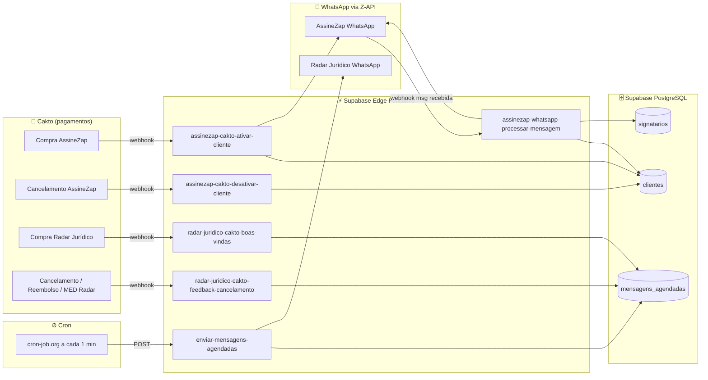

# Edge Functions — AssineZap + Radar Jurídico

## Visão geral de todos os fluxos



## Funções por produto

### AssineZap (assinatura eletrônica via WhatsApp)

| Função | Gatilho | O que faz |
|--------|---------|-----------|
| `assinezap-cakto-ativar-cliente` | Cakto compra aprovada | Cria/reativa cliente + msg boas-vindas |
| `assinezap-cakto-desativar-cliente` | Cakto cancelamento | Marca cliente como inativo |
| `assinezap-whatsapp-processar-mensagem` | Z-API (cada msg WhatsApp) | Fluxo completo: PDF → signatário → aceite → comprovante |

### Radar Jurídico (monitoramento processual)

| Função | Gatilho | O que faz |
|--------|---------|-----------|
| `radar-juridico-cakto-boas-vindas` | Cakto compra aprovada | Agenda 2 msgs (15min + 16min) |
| `radar-juridico-cakto-feedback-cancelamento` | Cakto cancel/refund/MED | Agenda msg feedback (5min) |

### Compartilhada

| Função | Gatilho | O que faz |
|--------|---------|-----------|
| `enviar-mensagens-agendadas` | Cron a cada 1 min | Processa e envia msgs pendentes |

## Como ver o fluxo de cada função

Cada pasta tem um arquivo `flow.mermaid` com o diagrama visual. Abra no GitHub para ver renderizado automaticamente.

## Secrets necessários

```
ASSINEZAP_ZAPI_INSTANCE
ASSINEZAP_ZAPI_TOKEN
RADAR_ZAPI_INSTANCE
RADAR_ZAPI_TOKEN
ZAPI_CLIENT_TOKEN
SUPABASE_SERVICE_ROLE_KEY
```
